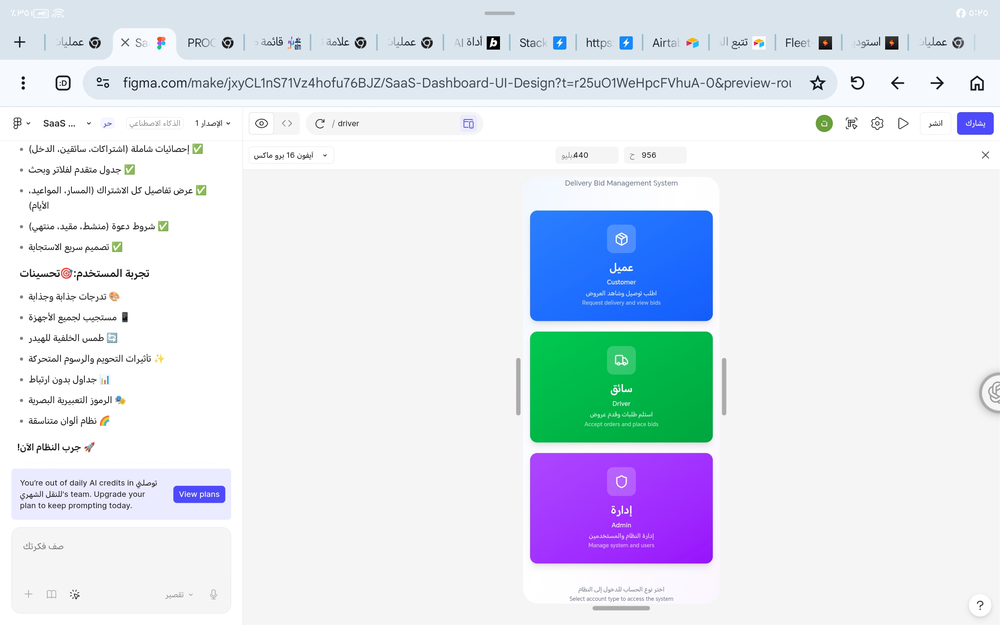
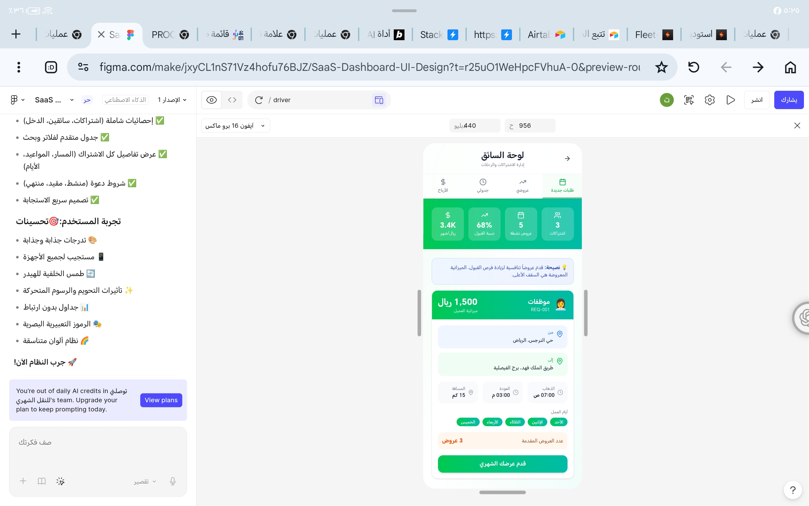
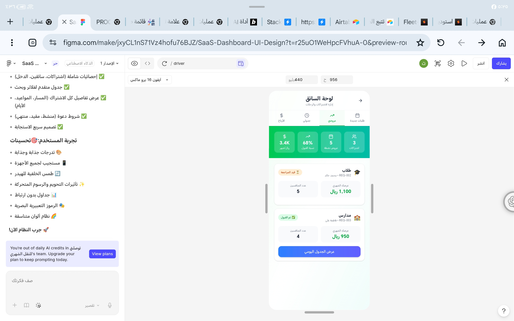
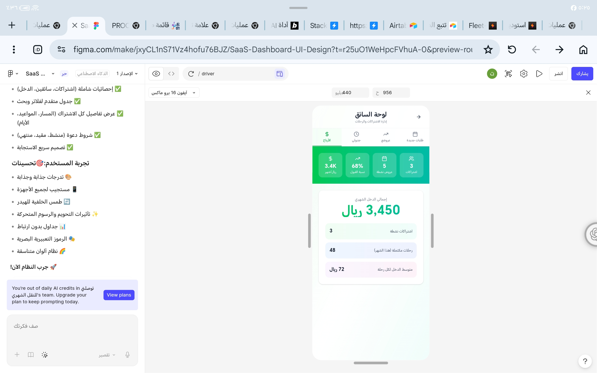

# توصّلني (Twasalni) - Delivery Bid System

منصة اشتراكات التوصيل الشهري - A monthly delivery subscription platform where clients post delivery requests, drivers compete with bids, and admins oversee operations.

## Screenshots

### Client Interface








## Overview

**توصّلني** (Twasalni) is a platform for monthly delivery subscriptions. It enables:
- **Clients (عملاء)**: Post monthly commute delivery requests
- **Drivers (سائقون)**: Submit competitive bids on requests
- **Admins (مديرون)**: Oversee and manage the entire platform

The entire interface is in Arabic with full RTL (Right-to-Left) support.

## Features

- 🔐 **Role-based authentication** (Client, Driver, Admin)
- 📱 **Mobile-first Arabic/RTL interface**
- 💰 **Competitive bidding system** for drivers
- 📍 **Location-based route planning** with Google Maps integration
- 💳 **Driver balance system** (50 SAR deduction on selection)
- 🔔 **Real-time notifications** via OneSignal
- 📊 **Admin analytics dashboard**
- 🎫 **Support ticket system**
- 🔒 **Row-level security** via Supabase

## Tech Stack

- **Frontend**: React + Vite + Tailwind CSS + shadcn/ui
- **Backend**: Express 5 + Node.js 24
- **Database**: Supabase PostgreSQL + Drizzle ORM
- **Authentication**: Session-based (express-session + PostgreSQL store)
- **Monorepo**: pnpm workspaces
- **Maps**: Google Maps API
- **Push Notifications**: OneSignal
- **Deployment**: Vercel (frontend + serverless API)

## Quick Start

### Prerequisites

- Node.js 24.x
- pnpm 10.33.4 (managed via corepack)
- Supabase account with PostgreSQL database

### Installation

```bash
# Enable corepack for pnpm
corepack enable

# Install dependencies
pnpm install

# Set up environment variables
cp .env.example .env
# Edit .env with your Supabase credentials and secrets
```

### Database Setup

```bash
# Run migrations
SUPABASE_DATABASE_URL="postgresql://..." pnpm --filter @workspace/db run push

# Apply Row-Level Security
SUPABASE_DATABASE_URL="postgresql://..." node scripts/apply-rls.mjs

# Seed default admin (loginCode: ADMIN2024)
SUPABASE_DATABASE_URL="postgresql://..." pnpm --filter @workspace/db run seed
```

### Development

```bash
# Start the development server
pnpm dev

# Or run frontend and backend separately:
pnpm --filter @workspace/delivery-bidding dev    # Frontend on port 3000
pnpm --filter @workspace/api-server dev           # API on port 3001
```

## Project Structure

```
├── artifacts/
│   ├── delivery-bidding/     # React frontend (Vite + Tailwind)
│   └── api-server/           # Express backend API
├── lib/
│   ├── db/                   # Drizzle ORM schema & migrations
│   └── api-zod/             # API types & Zod schemas (generated)
├── attached_assets/          # Application screenshots
├── scripts/                  # Utility scripts (RLS, seed, etc.)
└── migrations/              # SQL migration files
```

## User Roles & Authentication

### Client (عميل)
- Register with mobile number + password
- Create monthly commute requests
- Review and select driver bids
- View selected driver contact info

### Driver (سائق)
- Login with mobile + admin-assigned code
- Browse open requests
- Submit bids (requires 50 SAR balance)
- 50 SAR deducted when selected by client

### Admin (مدير)
- Login with code (default: `ADMIN2024`)
- Full CRUD on drivers and requests
- View platform analytics
- Manage support tickets
- Generate driver login codes

## Request Status Flow

```
OPEN → BIDDING (on first offer) → SELECTED → ACTIVE → COMPLETED
            ↓
       CANCELLED / EXPIRED / FROZEN (admin actions)
```

## API Documentation

See [API Routes documentation](./replit.md#api-routes) for detailed endpoint information.

## Deployment

### Vercel (Recommended)

See [DEPLOYMENT.md](./DEPLOYMENT.md) for complete deployment instructions.

Quick steps:
1. Import repository to Vercel
2. Set environment variables: `SUPABASE_DATABASE_URL`, `SESSION_SECRET`, `NODE_ENV=production`
3. Deploy from repository root (uses `vercel.json` config)

### Environment Variables

| Variable | Description | Required |
|----------|-------------|----------|
| `SUPABASE_DATABASE_URL` | Supabase Transaction Pooler connection string (port 6543) | Yes |
| `SESSION_SECRET` | Random secret for session signing | Yes |
| `NODE_ENV` | Set to `production` in production | Yes |
| `VITE_SENTRY_DSN` | Sentry DSN for error monitoring | No |
| `ENABLE_PRODUCTION_HARD_DELETE` | Enable hard deletes in production (use with caution) | No |

## Security

- **Row-Level Security** enabled on all tables
- **Session-based authentication** with PostgreSQL store
- **IDOR protection** on sensitive operations
- **Phone number privacy** (hidden until offer selected)
- **Balance checks** before driver bids
- **Soft deletes** for drivers
- **Production hard-delete gates** require explicit flags

## License

[Add your license here]

## Support

For issues and questions, please use the in-app support ticket system or contact the development team.

---

Made with ❤️ for Saudi Arabia's delivery ecosystem
